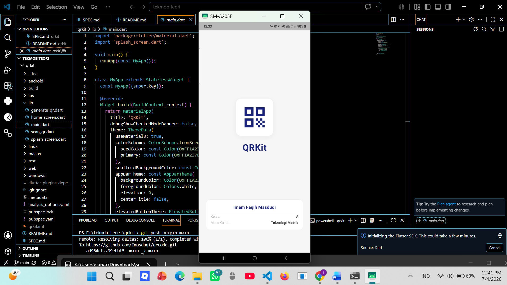
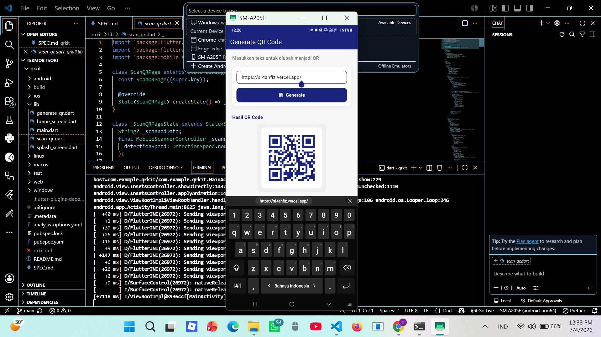
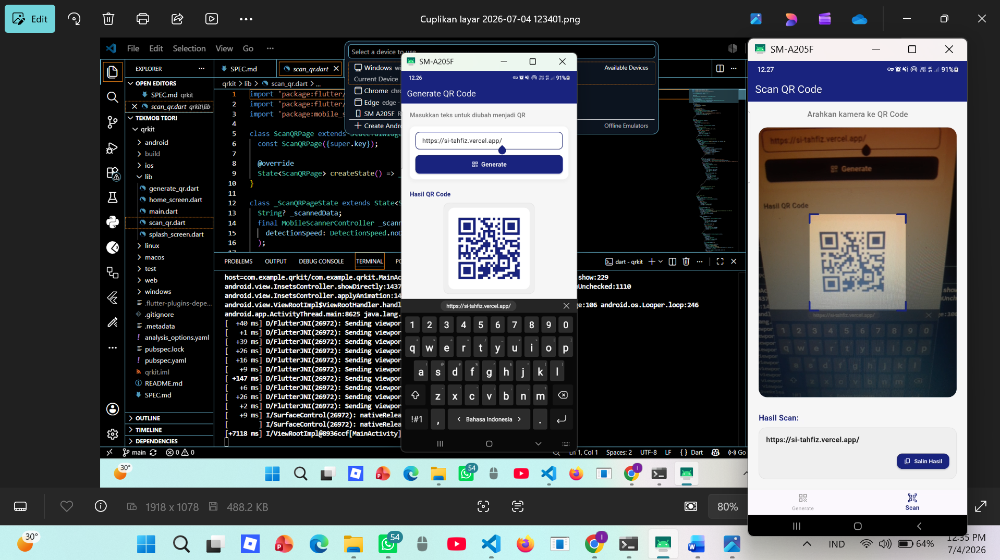

# QRKit — Aplikasi QR Code Flutter


> Aplikasi mobile Flutter untuk generate dan scan QR Code dalam satu aplikasi.

---

## Identitas Proyek

| | |
|---|---|
| **Nama Aplikasi** | QRKit |
| **Mata Kuliah** | Teknologi Mobile |
| **Nama Mahasiswa** | Imam Faqih Masduqi |
| **Kelas** | A |

---

## Deskripsi

QRKit adalah aplikasi Flutter yang memiliki dua fitur utama:
- **Generate QR Code** — mengubah teks input menjadi QR Code yang dapat ditampilkan di layar
- **Scan QR Code** — membaca QR Code menggunakan kamera perangkat dan menampilkan hasilnya

Navigasi antar fitur menggunakan BottomNavigationBar sehingga mudah diakses oleh pengguna.

---

## Fitur

- Splash screen dengan identitas mahasiswa
- Generate QR Code dari teks, URL, atau data apapun
- Scan QR Code secara real-time menggunakan kamera
- Overlay panduan area scan
- Validasi input kosong saat generate
- Navigasi dua tab yang simpel dan intuitif

---

## Tech Stack

| Kebutuhan | Package |
|---|---|
| Framework | Flutter |
| Bahasa | Dart |
| Generate QR | `qr_flutter: ^4.1.0` |
| Scan QR | `mobile_scanner: ^3.5.5` |

---

## Struktur Proyek

```
qrkit/
├── android/
│   └── app/src/main/
│       └── AndroidManifest.xml     ← permission kamera Android
├── ios/
│   └── Runner/
│       └── Info.plist              ← permission kamera iOS
├── lib/
│   ├── main.dart                   ← entry point & tema aplikasi
│   ├── splash_screen.dart          ← splash screen identitas
│   ├── home_screen.dart            ← wrapper BottomNavigationBar
│   ├── generate_qr.dart            ← halaman generate QR Code
│   └── scan_qr.dart                ← halaman scan QR Code
├── pubspec.yaml                    ← dependencies
└── SPEC.md                         ← spesifikasi proyek
```

---

## Alur Navigasi

```
App Launch
    ↓
SplashScreen (2 detik, auto-navigate)
    ↓
HomeScreen (BottomNavigationBar)
    ├── Tab 1 → GenerateQRPage
    └── Tab 2 → ScanQRPage
```

---

## Cara Menjalankan

### Prasyarat
- Flutter SDK sudah terinstall
- Device Android / iOS / Emulator siap
- Untuk fitur scan: wajib menggunakan device fisik atau emulator dengan kamera

### Langkah

**1. Clone atau buka project**
```bash
cd qrkit
```

**2. Install dependencies**
```bash
flutter pub get
```

**3. Jalankan aplikasi**
```bash
# Android / iOS (rekomendasi untuk fitur scan)
flutter run

# Web (hanya untuk testing UI generate, fitur scan terbatas)
flutter run -d web-server --web-port=8080
```

---

## Screenshot

| Splash Screen | Generate QR | Scan QR |
|---|---|---|
|  |  |  |

## Catatan Pengembangan

- Fitur scan QR membutuhkan **izin kamera** dari pengguna
- Pengujian fitur scan disarankan menggunakan **device Android fisik** bukan web browser
- Jika menggunakan web (`-d web-server`), fitur scan kamera mungkin tidak berjalan optimal
- Permission kamera sudah dikonfigurasi untuk Android (`AndroidManifest.xml`) dan iOS (`Info.plist`)

---

## Fase Pengembangan

| Fase | Deskripsi | Status |
|---|---|---|
| 0 | Setup project Flutter | ✅ |
| 1 | Tambah dependencies pubspec.yaml | ✅ |
| 2 | Setup permission kamera Android & iOS | ✅ |
| 3 | Buat SplashScreen | ✅ |
| 4 | Buat HomeScreen + BottomNavigationBar | ✅ |
| 5 | Buat GenerateQRPage | ✅ |
| 6 | Buat ScanQRPage | ✅ |
| 7 | Polish tema & styling | ✅ |
| 8 | Testing | ✅ |

---

## Lisensi

Proyek ini dibuat untuk keperluan tugas mata kuliah Teknologi Mobile — Universitas Ahmad Dahlan Yogyakarta.